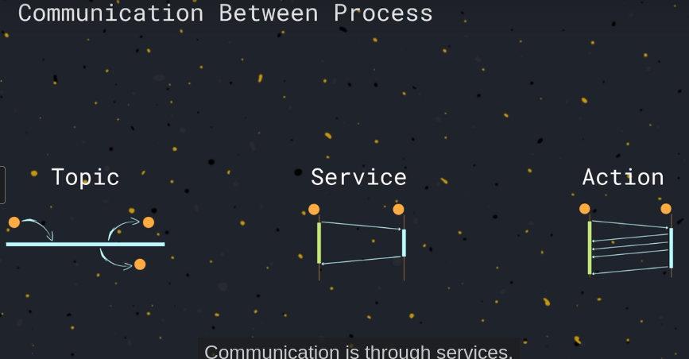

# self Driving and ROS2
course from udemy: https://www.udemy.com/course/self-driving-and-ros-2-learn-by-doing-odometry-control/

Self Driving and ROS 2 Learn By Doing Odometry Control


installing ros guide: https://docs.ros.org/en/humble/Installation/Ubuntu-Install-Debs.html


## Introduction
"Robotics is concerned with the study of those machines that can replace human beings in the execution of a task, as regards both physical activity and decision making"  - Robotics, Sciavicco Siciliano Villani

### What/Why is ROS?

ROS (Robot Operating System) is an open-source middleware framework that provides a collection of tools, libraries, and conventions for building robot applications. It's not an actual operating system, but rather a flexible framework that sits on top of an existing OS (typically Linux) to facilitate robot software development.

Key features of ROS include:
- Distributed computing architecture
- Message passing between processes
- Package management
- Common tools for development and debugging
- Hardware abstraction
- Device drivers
- Libraries for common robotics functionality

### ROS2 Architecture


#### 1. DDS (Data Distribution Service) Layer
- Core communication framework
- Provides reliable, real-time data distribution
- Implements publish/subscribe pattern
- Handles QoS (Quality of Service)

#### 2. RMW (ROS Middleware)
- Interface between ROS2 and DDS
- Abstracts DDS implementation details
- Supports multiple DDS vendors

#### 3. Client Libraries
- rclcpp (C++)
- rclpy (Python)
- Provide APIs for node creation and communication

#### 4. Core Components
- Nodes: Modular processes that perform specific tasks
- Topics: Named buses for message exchange
- Services: Request/response communication
- Actions: Long-running tasks with feedback
- Parameters: Runtime configuration values

#### 5. Tools Layer
- Launch system
- Command line tools
- Visualization (RViz2)
- Debugging tools (rqt)


### Inter-Process Communication in ROS

**ROS (Robot Operating System)** provides a robust framework for building complex robotic systems. Effective communication between different nodes (processes) is crucial for coordinating tasks and sharing information. Here's a brief overview of the primary communication mechanisms in ROS:

**1. Topics**

* **Concept:** Asynchronous, publish-subscribe mechanism. Publishers broadcast messages on a specific topic, while subscribers receive messages from that topic.
* **Data Flow:** One-to-many, many-to-many.
* **Use Cases:** 
    * Sensor data streaming (e.g., camera images, lidar scans)
    * Control signals (e.g., motor commands, joint velocities)
    * Status updates (e.g., battery level, robot pose)

**2. Services**

* **Concept:** Synchronous, request-response mechanism. A client sends a request to a service, and the service provides a response.
* **Data Flow:** One-to-one.
* **Use Cases:** 
    * Configuration requests (e.g., setting parameters, changing modes)
    * Complex computations (e.g., path planning, object recognition)
    * Triggering actions (e.g., starting/stopping a motor)

**3. Actions**

* **Concept:** Asynchronous, goal-oriented mechanism. Clients send goals to an action server, which executes the goal and provides feedback and results.
* **Data Flow:** One-to-one.
* **Use Cases:** 
    * Long-running tasks (e.g., navigation, manipulation)
    * Tasks with feedback (e.g., progress updates, status information)
    * Tasks with cancellation support

**Key Considerations:**

* **Topic Choice:** Choose descriptive topic names (e.g., `/camera/image_raw`, `/cmd_vel`).
* **Message Definition:** Define the data structure of messages using ROS message definition files (.msg).
* **Quality of Service (QoS):** Configure QoS parameters (e.g., durability, history depth) to optimize performance and reliability.
* **Error Handling:** Implement appropriate error handling mechanisms for robust communication.

**In Summary:**

* **Topics:** Ideal for streaming data and broadcasting information.
* **Services:** Suitable for one-time requests and responses.
* **Actions:** Well-suited for complex, long-running tasks with feedback and cancellation support.

By effectively utilizing these communication mechanisms, you can create modular, scalable, and robust robotic systems in ROS.



### Package Management

ROS (Robot Operating System) utilizes a hierarchical system for organizing and managing software components known as packages. A package is the fundamental unit of software distribution and build within the ROS ecosystem.

Key Concepts:

Workspace: A collection of one or more ROS packages. Workspaces provide a structured environment for developing, building, and installing ROS packages.
Manifest File (package.xml): A crucial file within each package that contains metadata about the package, including its name, version, dependencies, and authors.
Build System (catkin): The primary build system in ROS. It uses CMake to build packages within a workspace, resolving dependencies and generating necessary files.
Dependency Management: ROS effectively handles dependencies between packages. Packages can declare dependencies on other packages, ensuring that all required components are available during build and execution.
Benefits of Package Management:

Modularity: Packages promote modularity by encapsulating specific functionalities, making it easier to maintain and reuse code.
Reusability: Packages can be easily shared and reused across different ROS projects, fostering collaboration and reducing development time.
Maintainability: The hierarchical structure and dependency management simplify the process of updating and maintaining packages.
Versioning: Packages can be versioned, allowing for tracking changes and ensuring compatibility between different versions of packages.

### Application architecture
Ros2 installation includes packages for robotics development from various sources. We will work in the Ros2 workspace to develop our robot code, with standard packages in the Underlay and new packages in the Overlay. The Overlay can include both new and standard packages, with priority given to Overlay versions. Each package in the workspace will contain scripts for robot functionalities and configuration/startup files for nodes.

```bash
mkdir -p bumper_bot/src

cd bumper_bot 
colcon build

cd src

# create python package
ros2 pkg create --build-type ament_python bumperbot_py_examples

# create c++ package
ros2 pkg create --build-type ament_cmake bumperbot_cpp_examples

colcon build
```